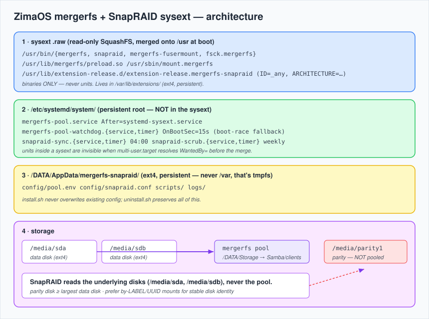
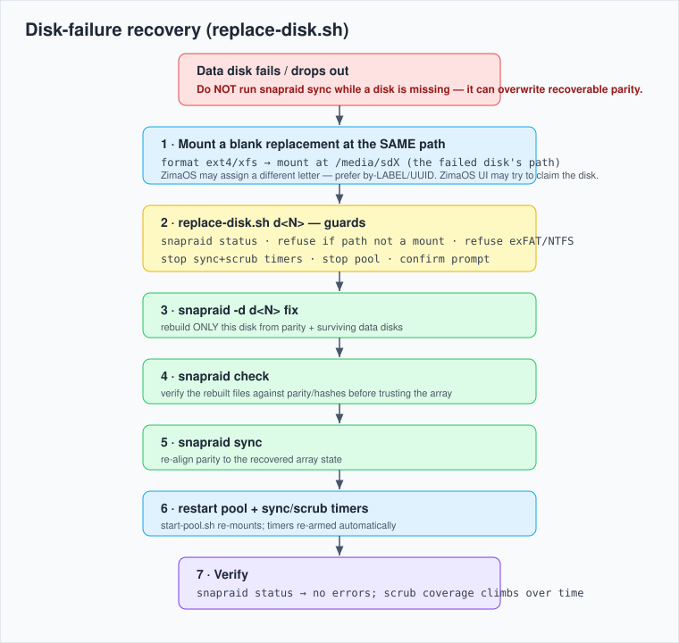

# zimaos-mergerfs-snapraid-sysext

Native **mergerfs** (union pool) + **SnapRAID** (snapshot parity) for ZimaOS,
packaged as a `systemd-sysext` module — same delivery mechanism as the ZimaOS
`cron` and `tailscale` sysext modules. No Docker for the storage layer, no
writes to the read-only ZimaOS root, survives reboots and (with `ID=_any`)
minor ZimaOS updates.

> **Status: amd64 fully hardware-validated on a ZimaCube Pro (2026-05-30).** Build →
> merge → pool → sync/scrub → file recovery → mass-delete guard → `replace-disk.sh`
> → **cold-boot boot-race (pool auto-mounted, timers armed)** → uninstall (data
> preserved). Full log: [docs/TESTLOG.md](docs/TESTLOG.md).
>
> **Caveats:** the array test was **single-spindle** (one disk partitioned into
> data+parity) — it validates every software path but not real multi-disk fault
> tolerance. **arm64 is built but not hardware-tested.** Use ext4/xfs on separate
> physical disks (parity ≥ largest data) before trusting real data.
>
> **Note:** ZimaOS 1.6.1 already ships an ancient **mergerfs v1.5.4** in its base
> `/usr`; this module shadows it with **2.42.0** while merged and reverts cleanly on
> uninstall — so it also *upgrades* the built-in mergerfs.

## What it gives you

- Flexible mixed-size disk pooling (mergerfs), disks stay individually readable.
- Parity protection without traditional RAID lock-in (SnapRAID), up to 6-disk.
- Scheduled sync (daily) + scrub (weekly), with a mass-deletion guard.
- Boot-race-safe autostart (the thing the manual PoC lacked).

## Verified facts

Rows tagged **hw** were checked live on a ZimaCube Pro (v1.6.1, kernel
6.12.25, amd64) on 2026-05-30.

| Item | Value | Conf. |
|---|---|---|
| Kernel FUSE | `CONFIG_FUSE_FS=y`, `CONFIG_FUSE_PASSTHROUGH=y`, `/dev/fuse` (10,229) present | sicher (hw) |
| **SquashFS comp** | kernel has **ZLIB/LZ4/LZO**, **NOT ZSTD/XZ** → `.raw` MUST be `-comp gzip` | sicher (hw) |
| usrmerge | `/sbin→usr/sbin`, `/bin→usr/bin`, `/lib→usr/lib` (all symlinks) | sicher (hw) |
| **PATH / bin dir** | default PATH is `/usr/bin:/usr/sbin`; **`/usr/local/bin` does not exist** → binaries relocated to `/usr/bin` | sicher (hw) |
| sysext target | `/var/lib/extensions` = `nvme0n1p8[/.extensions]` ext4; 10 modules already merged (cron, tailscale, zfw…) | sicher (hw) |
| build tooling | `mksquashfs 4.6.1`, `docker 27.5.1`, `curl`, `unsquashfs` all present on host | sicher (hw) |
| mergerfs static tarball | `mergerfs-2.42.0-static-linux_{amd64,arm64}.tar.gz` exists (+ armhf/i386/riscv64) | sicher |
| mergerfs internal layout | tarball ships `usr/local/bin/{mergerfs,mergerfs-fusermount,fsck.mergerfs,mergerfs.collect-info}`, `usr/local/lib/mergerfs/preload.so`, `sbin/mount.mergerfs` → **we relocate to `/usr/bin`, `/usr/lib`, `/usr/sbin`** | sicher (hw) |
| SnapRAID | source `snapraid-14.5.tar.gz` exists; pure userspace C, no kernel/daemon dep | sicher |
| Version pins are current | mergerfs `2.42.0` and snapraid `14.5` are also the **latest** releases (GitHub release API checked 2026-05-30) — zero drift | sicher |
| systemd ARCH token | `x86-64` (amd64), `arm64` (arm64) — used in `extension-release` | sicher |
| ZimaOS | `ID=zimaos`, `VERSION_ID=1.6.1`, ZimaCube amd64 | sicher (hw) |
| Data-disk mounts | ZimaOS automounts at `/media/sdX` (+ bind `/DATA/.media/`); current test disk `/media/sda` = `/dev/sdb` **exFAT** (1 disk only) | sicher (hw) |

## Repo layout

```
build/Dockerfile.snapraid   static snapraid build (multi-stage, scratch export)
build/build-snapraid.sh     build static snapraid per arch (buildx)
build/build-sysext.sh       assemble .raw sysext per arch + SHA256SUMS
units/                      systemd units (live in /etc, NOT in the sysext)
scripts/                    start/stop pool, snapraid sync/scrub, replace-disk
config/*.example            pool.env + snapraid.conf templates
install.sh / uninstall.sh   root installer (preserves data on uninstall)
docs/                       architecture.svg + recovery.svg (theme-neutral)
.github/workflows/build.yml CI: dual-arch build + ldd/--version smoke + release artifacts
```



## Build (on the ZimaCube, amd64; arm64 cross-built via qemu)

```sh
# one-time, only needed to cross-build arm64 on an amd64 host:
docker run --privileged --rm tonistiigi/binfmt --install all

cd build
./build-snapraid.sh amd64
./build-snapraid.sh arm64      # optional, for ZimaBoard
./build-sysext.sh   amd64
./build-sysext.sh   arm64      # optional
# -> build/out/mergerfs-snapraid_{amd64,arm64}.raw  +  build/out/SHA256SUMS
```

## Install

```sh
sudo ./install.sh
# then edit:
#   /DATA/AppData/mergerfs-snapraid/config/pool.env       (BRANCHES = data disks, NOT parity)
#   /DATA/AppData/mergerfs-snapraid/config/snapraid.conf  (parity/content/data = underlying disks)
sudo systemctl start mergerfs-pool.service
sudo /DATA/AppData/mergerfs-snapraid/scripts/snapraid-sync.sh   # first parity build
```

## Design notes / decisions

- **sysext merges only `/usr`** (+`/opt`). `build-sysext.sh` relocates the tarball's
  `/sbin/mount.mergerfs` to `usr/sbin/` so it lands at `/sbin` via the
  `/sbin -> /usr/sbin` usrmerge symlink. *Verify usrmerge once:* `ls -ld /sbin`.
  If `/sbin` is NOT a symlink to `/usr/sbin`, `mount.mergerfs` won't be on PATH —
  harmless, since the pool service calls the `mergerfs` binary directly. **wahrscheinlich**
- **Units live in `/etc/systemd/system/`, not in the sysext.** This is the lesson
  from the tailscale/cron modules: a unit *inside* the sysext isn't visible when
  `multi-user.target` resolves `WantedBy=` before `systemd-sysext.service` merges.
  Here only the *binaries* are in the sysext; the pool service is ordered
  `After=systemd-sysext.service` and a 15s watchdog timer is a fallback. **sicher** (reasoning), **unsicher** (until reboot-tested)
- **`extension-release` uses `ID=_any` + `ARCHITECTURE`** so the image survives
  ZimaOS minor updates without re-install, while refusing a wrong-arch merge.
  The systemd `ARCHITECTURE` token is **`x86-64`** for amd64 and **`arm64`** for
  arm64 (these are systemd's own identifiers, not the dpkg `amd64`/`arm64` — note
  amd64 differs). `build-sysext.sh` maps them. **sicher**
  Alternative (stricter, re-install per update like the tailscale module):
  set `ID=zimaos` + `VERSION_ID=1.6.1` in `build-sysext.sh`. **wahrscheinlich**
- **Boot-race ordering for the automounts:** `pool.env` ships
  `branches-mount-timeout=30` so mergerfs waits for the ZimaOS `/media/sdX`
  mounts at boot instead of failing on an empty branch. Option exists in
  mergerfs ≥2.40. **wahrscheinlich**
- **SnapRAID disk identity:** SnapRAID keys disks by path; ZimaOS assigns
  `/media/sdX` by detection order, so a replacement can land on a different
  letter. Prefer by-LABEL/UUID mounts; `replace-disk.sh` reconciles the path and
  refuses to proceed on a mismatch. **Risiko — handled, not eliminated.**
- **State under `/DATA/AppData`** (ext4 persistent); never `/var` (tmpfs).
- **SnapRAID is static** (`LDFLAGS=-static`) — the PoC's snapraid was dynamically
  linked against Debian glibc and only worked by luck on the test board.

## ⚠ Filesystem requirement

Data and parity disks should be **ext4 or xfs**. exFAT/NTFS lack POSIX
permissions, xattrs and hardlinks → mergerfs loses metadata and SnapRAID
move-detection / `pool` view degrade. The current test disks are
**exFAT** — reformat (destructive) before using for a real array. SnapRAID also
needs a dedicated **parity disk >= the largest data disk**.

## Disk-failure recovery

When a data disk fails, recover with `replace-disk.sh` — **never** run `snapraid
sync` while a disk is missing (it can overwrite still-recoverable parity).

```sh
# 1. Format the replacement ext4/xfs and mount it at the SAME path the failed
#    disk used (the `data d<N> <path>` line in snapraid.conf). ZimaOS may assign
#    a different /media/sdX letter — verify the mount; by-LABEL/UUID is safer.
# 2. Run the guided helper (it refuses a non-mount path or an exFAT/NTFS disk):
sudo /DATA/AppData/mergerfs-snapraid/scripts/replace-disk.sh d1
```

It runs `snapraid status`, stops the timers + pool, prompts for confirmation,
then `fix -d d1` → `check` → `sync`, and finally restarts the pool + timers.
Full flow: `docs/recovery.svg`.



## Troubleshooting

- **`systemd-sysext status` doesn't list the module / "incompatible image":**
  the `ARCHITECTURE` token may not match this systemd build. Check the merge log
  (`journalctl -u systemd-sysext`); as a quick test, rebuild with the
  `ARCHITECTURE=` line removed from `build-sysext.sh` (install.sh already selects
  the correct arch by `uname -m`).
- **Pool not mounted after reboot:** check `systemctl status mergerfs-pool.service`
  and that the watchdog timer fired (`systemctl status mergerfs-pool-watchdog.timer`).
  If branches were empty at mount time, confirm the ZimaOS automounts came up and
  that `branches-mount-timeout` is set in `pool.env`.
- **`allow_other` rejected:** only relevant for non-root access; needs
  `user_allow_other` in `/etc/fuse.conf`. Running via the root systemd unit, it's fine.

## Roadmap

- Phase 4: evaluate SnapRAID Daemon v1.9 (web UI) — sysext vs container. **unsicher**
- Phase 5: Mod-Store PR for 1-click install.
